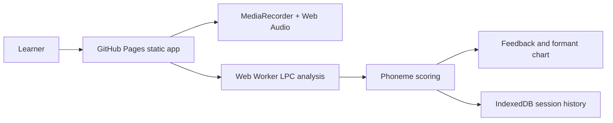

# Accent Coach

Live site: https://baditaflorin.github.io/accent-coach/

Private browser-based accent coach that analyzes speech and drills phoneme-level pronunciation.

Accent Coach records a target sentence, extracts vowel formants locally, compares them with native reference targets, and suggests specific drills. Audio is not uploaded and no account is required.

## Quickstart

```bash
npm install
make install-hooks
make dev
make test
make build
```

## What Works in v0.1.0

- EN/ES/IT practice sentence selection.
- Browser microphone recording with local playback.
- Worker-backed LPC formant extraction.
- F1/F2 chart with native target markers.
- Phoneme-level scoring and drill cues.
- Recent local sessions stored in IndexedDB.
- GitHub Pages build in `docs/`.

## Architecture



Docs:

- https://baditaflorin.github.io/accent-coach/
- docs/architecture.md
- docs/deploy.md
- docs/privacy.md
- docs/adr/

## Commands

```bash
make help
make dev
make lint
make test
make build
make smoke
make pages-preview
```

## Local Hooks

```bash
make install-hooks
```

Hooks run formatting checks, lint, typecheck, gitleaks, tests, build, and smoke tests locally. This repo intentionally does not use GitHub Actions.
